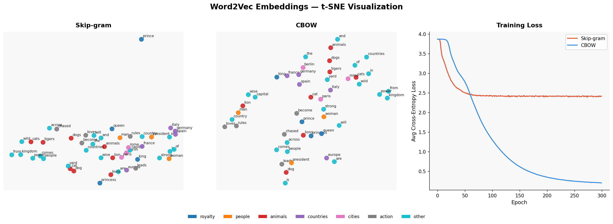

#  Word2Vec & t-SNE From Scratch

A clean, self-contained, and completely dependency-free (except for NumPy and Matplotlib) implementation of **Word2Vec (Skip-gram & CBOW)** architectures along with a custom **t-SNE (t-Distributed Stochastic Neighbor Embedding)** dimensionality reduction algorithm built entirely from scratch.

This project serves as an educational deep-dive into the mechanics of word embeddings, numerical stability in probability distributions, gradient descent optimization, and high-to-low dimensional manifold mapping.

---

##  Visualizing the Results

The script trains both models on a tiny semantic corpus, reduces the resulting 10-dimensional word vectors down to 2 dimensions using the custom t-SNE engine, and plots the spatial relationships alongside their training convergence curves:



### Key Observations from the Visualization:
1. **Semantic Clustering:** Notice how geographical entities (`france`, `germany`, `italy`, `spain`, `europe`) naturally cluster together under both architectures.
2. **Syntactic Alignment:** Royalty terms (`king`, `queen`, `prince`, `princess`) form distinct structural neighborhoods.
3. **Loss Dynamics:** **CBOW** converges significantly faster and achieves a lower cross-entropy loss on this specific small dataset compared to **Skip-gram**, as it smooths over context windows by averaging representations.

---

##  Key Features Implemented

### 1. Core Word2Vec Architectures
* **Skip-gram Architecture:** Predicts the surrounding context words given a single target center word ($P(w_{t+j} | w_t)$). Highly effective for capturing rare words or distinct semantic relations in larger corpora.
* **CBOW (Continuous Bag-of-Words) Architecture:** Predicts a target center word given the average distribution of its surrounding context words ($P(w_t | w_{t-j}, \dots, w_{t+j})$). Optimized via gradient routing distributed evenly back to all participating context vectors.
* **Numerical Utilities:** Pure NumPy implementation of a numerically stable `softmax` activation function ($x - \max(x)$) to avoid underflow/overflow errors during exponential scaling.

### 2. t-SNE Engine Built from Scratch
* **High-Dimensional Affinities:** Calculates conditional Gaussian probabilities $p_{j|i}$ across precise pairwise squared distances using the vector identity Matrix expansion: 
    $$\|x_i - x_j\|^2 = x_i^2 - 2x_i x_j^T + x_j^2$$
* **Perplexity via Binary Search:** Implements an automated root-finding binary search over vector variances ($\sigma_i$) to match user-defined target perplexities (effective number of neighbors).
* **Low-Dimensional Student-t Mapping:** Utilizes a heavy-tailed Student-t distribution (1-degree of freedom) in the embedded low-dimensional space to eliminate the crowding problem.
* **Custom Optimization Tricks:** Built-in **Early Exaggeration** factor ($4.0	imes$) during initial iterations to encourage tight, well-separated cluster configurations, alongside an adaptive learning rate (sign-based parameters/gains).

---

##  Mathematical Foundations

### Skip-gram Optimization
The model minimizes the negative log-likelihood of context words given center words. For a single center-context pair $(c, o)$, the cross-entropy loss gradient with respect to output weights ($W_{out}$) and input weights ($W_{in}$) flows as follows:

$$rac{\partial \mathcal{L}}{\partial \mathbf{z}} = \mathbf{\hat{p}} - \mathbf{y}_o$$

$$rac{\partial \mathcal{L}}{\partial W_{out}} = \mathbf{h}^T \otimes rac{\partial \mathcal{L}}{\partial \mathbf{z}}$$

$$rac{\partial \mathcal{L}}{\partial \mathbf{W}_{in}[c]} = rac{\partial \mathcal{L}}{\partial \mathbf{z}} W_{out}^T$$

Where $\mathbf{\hat{p}}$ is the predicted softmax distribution, $\mathbf{y}_o$ is the one-hot encoded ground truth context word, and $\mathbf{h}$ is the active hidden/embedding layer.

### t-SNE Gradient Descent
The custom dimensionality reduction engine minimizes the Kullback-Leibler (KL) divergence between high-dimensional joint probability distribution $P$ and low-dimensional distribution $Q$:

$$\mathcal{C} = D_{KL}(P || Q) = \sum_{i} \sum_{j} p_{ij} \log rac{p_{ij}}{q_{ij}}$$

The analytical gradient mapping step for each low-dimensional coordinate $y_i$ is explicitly calculated as:

$$rac{\partial \mathcal{C}}{\partial y_i} = 4 \sum_{j} (p_{ij} - q_{ij})(y_i - y_j)\left(1 + \|y_i - y_j\|^2
ight)^{-1}$$

---

## Getting Started

### Prerequisites
Make sure you have a Python environment set up with standard data science packaging:
```bash
pip install numpy matplotlib
```

### Running the Project
Simply clone your repository and execute the main pipeline script. It will read the sample corpus, output live epoch losses, execute t-SNE coordinate updates, print semantic neighbor tables, and display the final plots.

```bash
python word2vec_from_scratch.py
```

### Expected Console Output
```text
Vocabulary size : 35
Corpus length   : 98 tokens

==================================================
Training Skip-gram...
==================================================
  [SkipGram] Epoch  50 | Loss: 2.5312
  [SkipGram] Epoch 100 | Loss: 2.4419
  ...
==================================================
Word similarities (Skip-gram)
==================================================
  'king' → [('queen', 0.724), ('prince', 0.612), ('rules', 0.495)...]
```

---

## Configuration & Hyperparameters

You can tweak the parameters at the bottom of `word2vec_from_scratch.py` to observe how embedding spaces scale:

```python
EMBED_DIM = 10    # Dimensions of the hidden embedding layer
EPOCHS    = 300   # Neural network training iterations
LR        = 0.05  # Learning rate for SGD
PERPLEXITY = 5.0  # Effective number of neighbors for t-SNE search
```

---

## License
This project is open-source and available under the **MIT License**. Feel free to use, modify, and distribute it for educational or research purposes!
